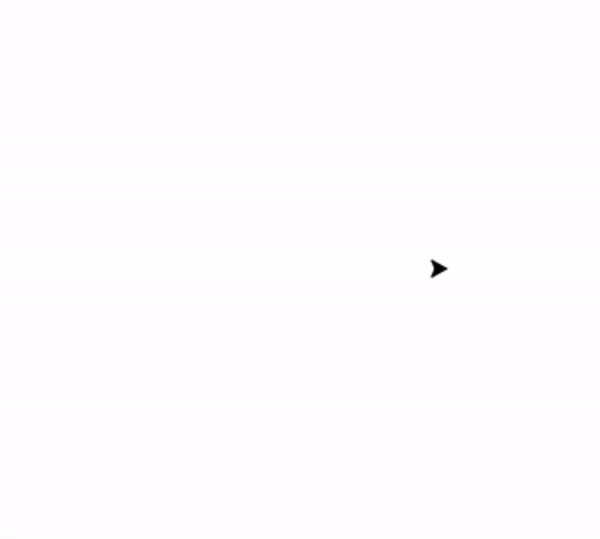

# Lesson 8 - Conditionals

[Repl.it](https://repl.it/~)

Important Points:
```markdown

` if num > 10: `                      # basic if-statement
` elif (insert another condition): `  # else-if-statement
` else: `                             # else statement

```

### Project 1 - If Shapes
```Generate a random number! If the random number is greater than 10, draw an octagon. If not, draw a hexagon!```


### Project 2 - Four Corners
```Have the turtle jump around with the arrow keys and draw a shape wherever you are!```




### Project 3 - Crazy Art!
```Create 2-3 functions that draw shapes with random colors and random sizes. Connect those functions to keys. When we press those keys really quickly, it turns into crazy art!```


