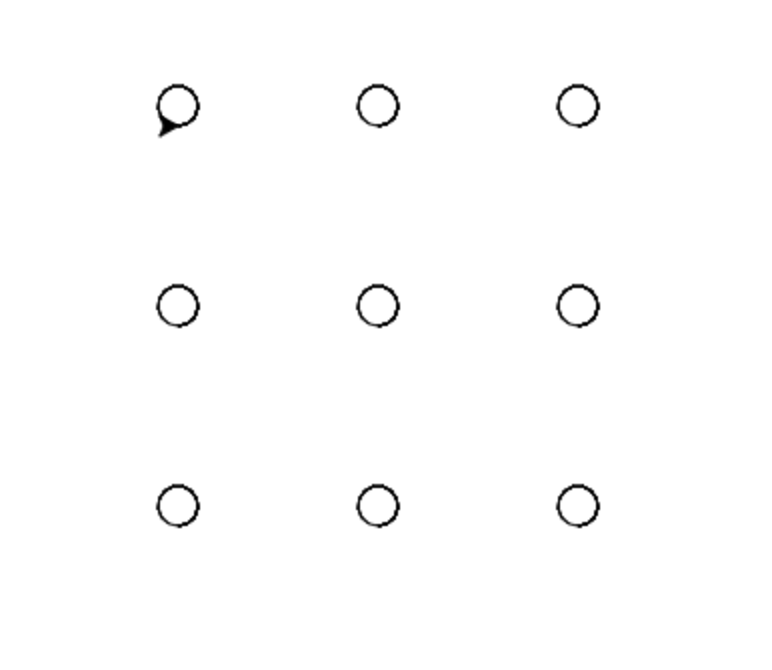

# Lesson 6.5 - Event Listeners

[Repl.it](https://repl.it/~)

```markdown

` screen = turtle.Screen() `      # create a screen object
` screen.onkey(nameOfYourFunction, "key") `   # link the function to the keys
` screen.listen() `   # the screen starts "listening" for your keyboard input

```

### Project 1


### Project 2


### Project 3
