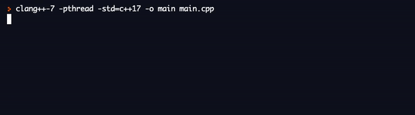
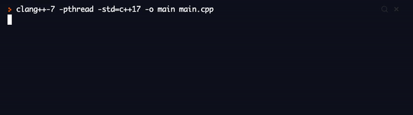

# Lesson 3 - Branches

[Repl.it](https://repl.it/~)

Key Terms:
```markdown
variable - a piece of data/information for us to use in our code
integer - a number variable (ex: 8)
string - a word, sentence, or a collection of characters in a variable (ex: "i like turtles")
% - modulo - gives the remainder --> ex: 5 % 2 = 1
```

Important Code:
```markdown

`myVar = input("Enter your input: ") `      # prompt user for input, save as variable
`str(myVar) `              # cast a variable to a string (word, sentence, or a collection of characters)
`myVar[0] `                # access the first letter in the string
`len(myVar) `               # returns the size of the string (number of characters)

```

### Project 1 - Numbers 1-10
  - Prompt the user for a number between 1 and 10
  - Use if and else statements to determine whether the number is even or odd
  - Use if and else statements to determine whether the number is greater than 5
  - Print the results to the console
  
  
### Project 2 - Number Guesser
  - Prompt the user to enter a number that is divisible by 2
  - Then prompt the user to enter a number that is divisible by 4
  - Use conditionals to determine whether both numbers are correct, one is correct, or neither are correct
  - Print the results to the console
  
  

### Project 3 - Ice Cream Specials
  There is a special sale for ice cream today! If only it were actually hot to go out and buy some... Oh well! Pretend you are in Africa! There are different deals for different ages!
  - Ask the user to enter their age!
  - Split the ages into 3 different categories (ex: ages 0-18, 19-60, 60+
  - One of those categories must have a follow up question (ex: "Do you have kids?")
  - Use if-statements (conditionals) to print out their special deal for the day!
  
  
  
  
### Final Project - Fortune Teller
  For this project, you are going to create your own fortune teller program! 
  - First, tell your user what this program does and what to expect
  - Prompt them to enter a number (preferrably 1, 2, or 3)
  - Then ask them to enter another number (again, maybe 1 , 2, or 3)
  - Come up with 9 different fortunes (hopefully they are nice fortunes, but they don't have to be!)
  - Why 9? If we have them pick 1 of 3 numbers twice, how many total combinations are there? What if we had 4 options?
  - Now, using your newly gained knowledge of conditionals and if-statements, have the program print their specific fortune to the console
  - If they do not enter the correct number, your program should not print a fortune, but tell the user that their input was incorrect.
  - Make it fun!

  
