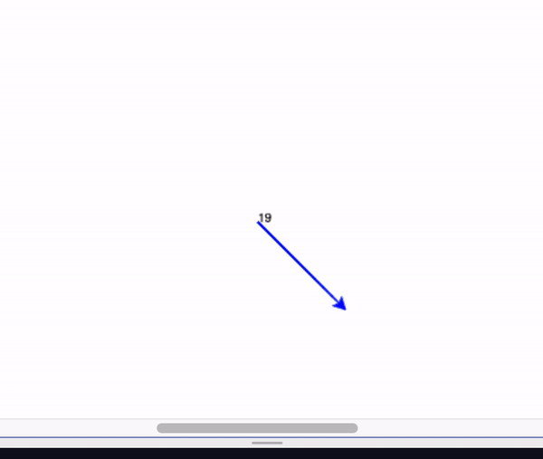

# Lesson 8 - Conditionals

[Repl.it](https://repl.it/~)

Important Points:
```markdown

` if num > 10: `                      # basic if-statement
` elif (insert another condition): `  # else-if-statement
` else: `                             # else statement

` while True: `                       # begin a while-loop
`   if a > b: `                       # random condition to check
`     break   `                       # jump out of a while-loop

```

### Project 1 - If Shapes
```Generate a random number! If the random number is greater than 10, draw an octagon. If not, draw a hexagon!```


### Project 2 - Which Way?!
```Have the computer generate a random number. Using conditionals, have the turtle do different things based off the random number! If it is less than 11, have it go forward, if it is less than 21 and greater than 11, have it turn right 45 degrees, then go forward. Otherwise, have the turtle turn right 90 degrees and go forward! Have the turtle change colors for each case!```



### Project 3 - Rebounder!
```Draw a box for the ball to bouce off! Use a while True loop to get the ball to keep moving. Use conditionals to have the ball bounce back before leaving the box!```


### Project 4 - RACE!!!
```Draw two lines, then create two more turtle objects. Place them side-by-side on the left-most line. Using loops and random numbers, have them go forward a small amount of random steps (like between 3-5), but since you are using a loop, have them do that many times (like 100!) Use conditionals to see which turtle makes it to the finish line first and then have the winner write "WINNER!" on the screen!```


