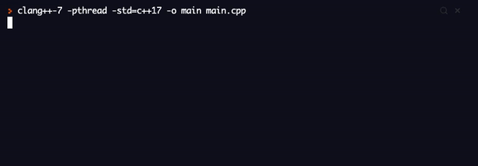

# Lesson 3 - Branches

[Repl.it](https://repl.it/~)

Key Terms:
```markdown
variable - a piece of data/information for us to use in our code
integer - a number variable (ex: 8)
string - a word, sentence, or a collection of characters in a variable (ex: "i like turtles")
% - modulo - gives the remainder --> ex: 5 % 2 = 1
```

Important Code:
```markdown

`myVar = input("Enter your input: ") `      # prompt user for input, save as variable
`str(myVar) `              # cast a variable to a string (word, sentence, or a collection of characters)
`while (conditional expression): `  #declare a while loop
example: `while (myVar > 0): `
`for i in range(myVar): `   #basic for loop

```
  
### Final Project - Fortune Teller
  For this project, you are going to create your own fortune teller program! 
  - First, tell your user what this program does and what to expect
  - Prompt them to enter a number (preferrably 1, 2, or 3)
  - Then ask them to enter another number (again, maybe 1 , 2, or 3)
  - Come up with 9 different fortunes (hopefully they are nice fortunes, but they don't have to be!)
  - Why 9? If we have them pick 1 of 3 numbers twice, how many total combinations are there? What if we had 4 options?
  - Now, using your newly gained knowledge of conditionals and if-statements, have the program print their specific fortune to the console
  - If they do not enter the correct number, your program should not print a fortune, but tell the user that their input was incorrect.
  - Make it fun!

  
